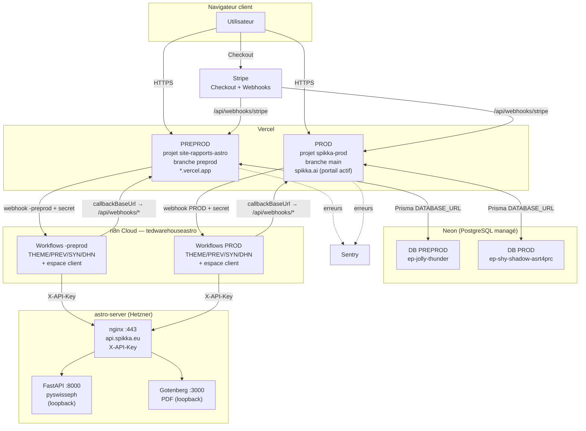
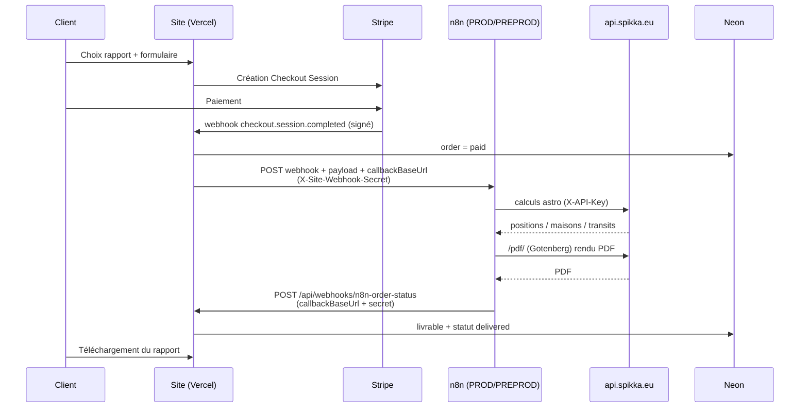

# Architecture technique Spikka — PREPROD & PROD

> Statut : 🟢 ACTIF
> Date : 2026-07-18
> Portée : cartographie complète de la stack (site, base, moteur astro, orchestration, paiement, observabilité) et de son câblage entre PREPROD et PROD.
> Sources : code `SITE/`, dépôt `FRA/`, live n8n (`tedwarehouseastro`), serveur `astro-server` (état des lieux SSH 2026-07-18), `SITE/docs/RUNBOOK-MISE-EN-PROD.md`, règles `.cursor/rules/*`.
> Liés : [`AUDIT-CYBERSECURITE-2026-07-18.md`](./AUDIT-CYBERSECURITE-2026-07-18.md), [`RUNBOOK-DR.md`](./RUNBOOK-DR.md), [`../API SE/INVENTAIRE-SERVEUR-ASTRO-SWISSEPH-GOTENBERG.md`](../API%20SE/INVENTAIRE-SERVEUR-ASTRO-SWISSEPH-GOTENBERG.md).

---

## 1. Vue d'ensemble

Spikka génère et livre des rapports astrologiques (Thème, Prévisions, Synastrie, DHN) et un espace client (roue natale, transits, Spikka Connect). La stack se compose de **cinq briques** reliées par des webhooks signés :

1. **Site Next.js** hébergé sur **Vercel** (2 environnements : preprod + prod).
2. **Base PostgreSQL** managée sur **Neon** (1 base par environnement).
3. **Moteur de calcul astronomique** — serveur privé **`astro-server`** (API FastAPI + Swiss Ephemeris + Gotenberg PDF), exposé via **`api.spikka.eu`**.
4. **Orchestration** des rapports sur **n8n Cloud** (`tedwarehouseastro`), workflows dédoublés PROD/PREPROD.
5. **Paiement** via **Stripe** (Checkout + webhooks).

Observabilité **Sentry**, authentification **Auth.js (JWT)**, plus services annexes (Vercel Blob, Upstash Redis, Google Places, Cloudflare Turnstile, Gmail via n8n).

---

## 2. Deux environnements — règle d'isolation

> Règle d'or (bonnes pratiques) : **PREPROD et PROD sont ISO** (mêmes workflows, même moteur), sauf pendant le développement d'une feature en cours de test avant bascule. Le câblage entrée/sortie est isolé par environnement.

| Dimension | PREPROD (staging) | PROD |
|---|---|---|
| **Projet Vercel** | `site-rapports-astro` | `spikka-prod` |
| **Branche Git déployée** | `preprod` | `main` |
| **URL** | `https://site-rapports-astro-iastrowww.vercel.app` | `https://spikka.ai` (`www`→apex 308) |
| **Accès** | ouvert (dev/tests) | **fermé par portail** (`SITE_GATE_PASSWORD`) jusqu'au go-live |
| **Base Neon** | `ep-jolly-thunder-…` (projet `flat-recipe-45945783`) | `ep-shy-shadow-asrt4prc` (projet `bold-shape-92238262`, `eu-central-1`, PG17) |
| **Workflows n8n rapports** | `*-site-order-preprod` | `*-site-order` |
| **Webhooks utilitaires n8n** | espace-client-natal-**preprod**, transits/connect -preprod | espace-client-natal, transits/connect PROD |
| **Moteur astro** | **partagé** : `api.spikka.eu` (même serveur) | idem |
| **Stripe** | clé `sk_test_` (mode déduit du préfixe) | clé `sk_live_` |

**Contrôle du build (`SITE/vercel.json` → `ignoreCommand`)** : `scripts/vercel-ignore-fra-branch.mjs` garantit que le projet `spikka-prod` ne builde que `main`, `site-rapports-astro` que `preprod`, et jamais les branches backup FRA.

**Livraison** : `npm run ship:preprod` (push `preprod` → staging) puis `npm run ship:prod` (promotion `preprod`→`main` → prod). Voir `.cursor/rules/deploiement-preprod-prod-spikka.mdc`.

---

## 3. Briques détaillées

### 3.1 Site / application (Vercel + Next.js)

| Élément | Valeur | Source |
|---|---|---|
| Framework | Next.js (App Router), `withSentryConfig` | `SITE/next.config.ts` |
| Repo | `site-rapports-astro` (GitHub) | — |
| Portail prod | middleware, cookie `spikka_gate` (SHA-256 du mot de passe), exemptions `/api/health`, `/api/webhooks/*`, `/api/cron/*` | `SITE/middleware.ts` |
| Crons Vercel | `/api/cron/resync-b2b-subscriptions` (horaire), `/api/cron/refresh-daily-transits` (05:00), `/api/cron/monitor-orders` (*/10 min) — auth `Bearer CRON_SECRET` | `SITE/vercel.json` |
| Healthcheck | `GET /api/health` (+ `?deep=1` = `SELECT 1`) | `SITE/app/api/health/route.ts` |

### 3.2 Base de données (Neon + Prisma)

- **ORM** Prisma, datasource `env("DATABASE_URL")`, client singleton `SITE/lib/db.ts` (pattern `globalThis`, requis serverless).
- **URL pooled** (PgBouncer, `?pgbouncer=true&connection_limit=…&pool_timeout=…`) pour le runtime ; **URL directe** pour `prisma migrate deploy`.
- 1 base isolée par environnement (voir §2). **Aucune** connexion croisée preprod↔prod.

### 3.3 Moteur de calcul astronomique — `astro-server`

Serveur privé (Hetzner, IPv4 `46.225.174.155`, IPv6 `2a01:4f8:1c1e:d9aa::1`). Détail exhaustif : [`../API SE/`](../API%20SE/).

| Composant | Port | Exposition |
|---|---|---|
| nginx gateway TLS | **443** (`api.spikka.eu`) | public (UFW restreint à n8n Cloud + IP dev), header **`X-API-Key`** sauf `/health` |
| FastAPI + pyswisseph | 8000 | **loopback only** |
| Gotenberg (PDF) | 3000 | **loopback only** (via `/pdf/`) |
| nginx legacy clair | 80 | public — ⚠ voir audit cyber (finding #1) |
| SSH | 22 | public (clé only, fail2ban) |

**Endpoints** (contrat) : `POST /western/planets`, `POST /batch/western/planets`, `POST /western/houses`, `GET /transits`, `GET /moon`, `GET /eclipses`, `GET /progressions`, `GET /progressions/eclipses`, `POST /directions/primary`, `POST /solar-return`, `POST /lunar-return`, `GET /health`.

**Consommateur** : **uniquement n8n** (les workflows appellent `https://api.spikka.eu/*` avec `X-API-Key`). Le site Next.js n'appelle **pas** l'API astro directement.

### 3.4 Orchestration (n8n Cloud)

Instance `https://tedwarehouseastro.app.n8n.cloud`. Chaque rapport = une paire **PROD + PREPROD**.

| Rapport | Workflow PROD (ID) | Workflow PREPROD (ID) | Webhook PROD | Webhook PREPROD |
|---|---|---|---|---|
| THEME | `TbLFaLOx1dLW9oNP` | `JVdFEkeD6rnYBnKX` | `theme-site-order` | `theme-site-order-preprod` |
| PREV | `szL522DJiXkppyt1` | `jKwmxAm3HvjpHC5U` | `prev-site-order` | `prev-site-order-preprod` |
| SYN | `xfenvGOyoYB6GyZH` | `eshtbInOYSd3Cz3Z` | `syn-site-order` | `syn-site-order-preprod` |
| DHN | `uA6jTzmayt2OXByY` | `Z9JgGaLoJhKNo8mB` | `dhn-site-order` | `dhn-site-order-preprod` |

Plus workflows **espace client** (roue natale `espace-client-natal[-preprod]`, transits daily/client, Spikka Connect SYN/invitation/résultat) — chacun en paire PROD/PREPROD (créés 2026-07-18). Liste canonique : `SITE/scripts/n8n-prod-workflows.json`.

**Câblage entrée (site → n8n)** : POST signé `X-Site-Webhook-Secret: N8N_WEBHOOK_SECRET`, URL par `webhookUrlForReportType()` (`SITE/lib/n8n-order-webhook.ts`).
**Câblage sortie (n8n → site)** : `callbackBaseUrl` (calculé par `getAppBaseUrl`, `SITE/lib/app-url.ts`) → `POST /api/webhooks/n8n-*` (secret symétrique).

| Callback route (site) | Rôle |
|---|---|
| `/api/webhooks/n8n-order-status` | statut livraison rapports (PDF, vault) |
| `/api/webhooks/n8n-natal-chart` | roue natale espace client |
| `/api/webhooks/n8n-connect` | dashboard Spikka Connect |
| `/api/webhooks/n8n-transits` | snapshot transits du jour |
| `/api/webhooks/n8n-syn-dashboard` | dashboard synastrie |
| `/api/webhooks/n8n-run-failed` | error-workflow n8n → alerte Sentry + order failed |

Toutes valident `x-site-webhook-secret === N8N_WEBHOOK_SECRET` + rate limits.

### 3.5 Paiement (Stripe)

- Checkout : `SITE/app/api/checkout/{theme,prev,syn,dhn,pack,subscription}/route.ts`.
- Webhook entrant : `POST /api/webhooks/stripe` — validation `stripe-signature` + `STRIPE_WEBHOOK_SECRET`.
- Événements : `checkout.session.completed` (déclenche n8n), `charge.refunded`, `invoice.paid`/`invoice.payment_succeeded`, `customer.subscription.updated`/`.deleted`.
- **Mode test/live déduit du préfixe de clé** (`sk_test_`/`sk_live_`), pas de flag dédié (`stripeSecretKeyMode()`).

### 3.6 Observabilité (Sentry)

`@sentry/nextjs` — server (`sentry.server.config.ts`), edge (`sentry.edge.config.ts`), client (`instrumentation-client.ts`), hook `instrumentation.ts` (`onRequestError`). DSN : `SENTRY_DSN` (server) / `NEXT_PUBLIC_SENTRY_DSN` (client). Alertes métier : `SITE/lib/sentry-{webhook,order,wallet}-alerts.ts`.

### 3.7 Authentification (Auth.js v5)

- `SITE/auth.ts`, stratégie **JWT** (`maxAge` 30 j), providers **Google OAuth** (si configuré) + **Credentials**.
- Admin : `ADMIN_EMAILS` + **TOTP** (`ADMIN_REQUIRE_TOTP`, `TOTP_ENCRYPTION_KEY`).
- Anti-bot : **Cloudflare Turnstile** (`TURNSTILE_SECRET_KEY`).

### 3.8 Services annexes

| Service | Rôle | Var(s) |
|---|---|---|
| Vercel Blob | stockage samples/branding/livrables | `BLOB_READ_WRITE_TOKEN` |
| Upstash Redis | rate-limit multi-instance | `UPSTASH_REDIS_REST_URL`, `UPSTASH_REDIS_REST_TOKEN` |
| Google Places | autocomplétion lieu de naissance | `GOOGLE_MAPS_PLACES_SERVER_KEY` |
| Nominatim (OSM) | secours géocodage | `NOMINATIM_HTTP_USER_AGENT` |
| Gmail (via n8n) | e-mails transactionnels | credential n8n (pas de var site) |
| IONOS DNS | zone `spikka.ai` / `api.spikka.eu` | — |

---

## 4. Flux principal — commande d'un rapport

**Isolation** : un paiement sur `spikka.ai` déclenche les workflows **PROD**, qui rappellent **`spikka.ai`**. Un paiement sur le staging déclenche les workflows **-preprod**, qui rappellent le **staging**. Le retour est piloté par `callbackBaseUrl` (jamais d'URL en dur côté n8n comme source unique — repli par environnement seulement).

---

## 5. Secrets & variables — où ils vivent

| Secret / var | Emplacement | Jamais dans |
|---|---|---|
| `DATABASE_URL` | Vercel (par projet) + `SITE/.env.local` | Git |
| `N8N_WEBHOOK_SECRET` (+ `_PREPROD`) | Vercel + n8n (header) + `.env.local` | Git |
| `N8N_*_WEBHOOK_URL` (+ `_PREPROD`) | Vercel (par projet) | — |
| `N8N_API_KEY` | `SITE/.env.local` (ops uniquement) | Git, chat |
| `STRIPE_SECRET_KEY`, `STRIPE_WEBHOOK_SECRET` | Vercel + `.env.local` | Git |
| `ASTRO_API_KEY` (`X-API-Key`) | `/root/astro-api-key.txt` (serveur) + n8n (nœuds) + `.env.local` | Git, chat, backups (caviardé) |
| `AUTH_SECRET`, OAuth Google | Vercel + `.env.local` | Git |
| `SENTRY_DSN` / `NEXT_PUBLIC_SENTRY_DSN` | Vercel | — |
| `CRON_SECRET` | Vercel | Git |
| `SITE_GATE_PASSWORD` | Vercel prod (retiré au go-live) | Git |

> Rappel incident (journal API SE, 2026-07-08) : la clé API avait fuité en clair dans un backup de workflow → `n8n-export-prod-workflows.mjs` **caviarde** désormais `X-API-Key` (walk récursif). Toute manipulation de backup doit préserver ce caviardage.

---

## 6. Points de défaillance uniques (SPOF) & résilience

| Brique | SPOF ? | Résilience actuelle | Voir |
|---|---|---|---|
| **astro-server** | ⚠ **Oui** (VM unique, moteur propriétaire) | code + configs + éphémérides versionnés dans `FRA/API SE/` ; runbook de reconstruction | [`RUNBOOK-DR.md`](./RUNBOOK-DR.md) |
| Site Vercel | Non | multi-région Vercel, redeploy depuis Git | — |
| Neon | Faible | managé, PITR Neon | RUNBOOK-DR §DB |
| n8n Cloud | Faible | managé ; workflows miroir dans `FRA/` | livraison-fiable.mdc |
| Stripe | Non | SaaS | — |
| DNS (IONOS) | ⚠ registrar unique | — | RUNBOOK-DR |

Le moteur `astro-server` est la brique la plus critique en cas de cyberattaque : c'est l'objet principal du [runbook de reconstruction](./RUNBOOK-DR.md) et de l'[audit cyber](./AUDIT-CYBERSECURITE-2026-07-18.md).

---

## 7. Références

- Câblage n8n détaillé : `SITE/docs/RUNBOOK-MISE-EN-PROD.md`, `.cursor/rules/n8n-isolation-preprod-prod.mdc`, `.cursor/rules/n8n-prod-tedwarehouse.mdc`.
- Moteur astro : `FRA/API SE/` (inventaire, journal, contrats API, correspondance IP/URL).
- Livraison : `.cursor/rules/livraison-fiable.mdc`, `.cursor/rules/deploiement-preprod-prod-spikka.mdc`.
- Specs workflows : `FRA/{THEME,PREV,SYN,DHN}/DOCUMENTATION WORKFLOW *.md`.
